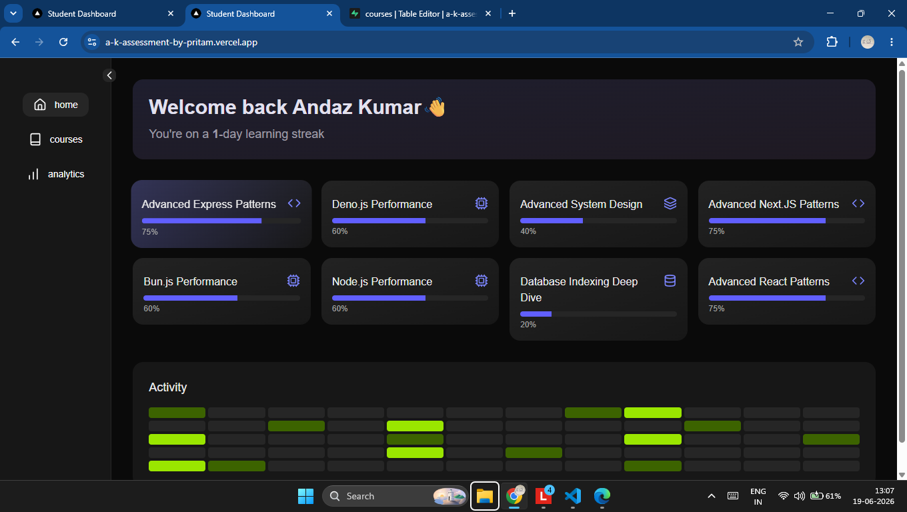

#  Next-Gen Learning Dashboard

A modern, animated student dashboard built with Next.js App Router, Supabase, Tailwind CSS, and Framer Motion.

------

## 🔴 Demo

### 🔴 🖼️ Screenshot
<a href="https://a-k-assessment-by-pritam.vercel.app/">

</a>

-------

##  Highlights

- **Server-first architecture** using React Server Components for direct data fetching from Supabase
- **Zero layout shift animations** using transform + opacity with Framer Motion
- **Responsive design** across desktop (sidebar), tablet (collapsed), and mobile (bottom nav)

------

##  Key Decisions

- Split logic between **Server (data)** and **Client (interaction)** components
- Avoided API routes(hook) for simpler and faster data flow
- Implemented shared navigation with smooth scrolling UX

----

## Challenges I faced

- Managing server/client with animations(using server and client component cautiously, solved the issue)
- Rendering dynamic icons from DB(importing all icons, solved the issue)


---
## Set Up Guide
```
npm run corepack:enable
``` 
```
pnpm install
``` 
```
npm run dev
```

